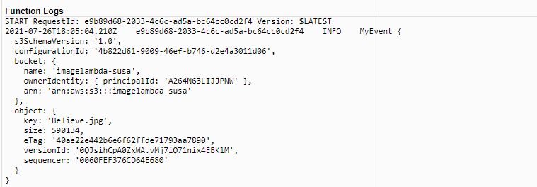
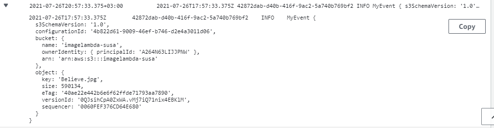

# image-lambda

### Auther : Sukina Abu-Hammad & Sara Altaweel

### Pull Request :

[Pull request](https://github.com/Sukina12/image-lambda/pull/1)

### My Image.Json File:

### Lambda Usage :
  * We use Lambda to trigger an event by upload image or folder using AWS s3. 
  * To see the event : 
    1. monitor
    2. view console cloudWatch
    3. log streams
    4. go to last one which is your event

### Issues:
  * I can't start the code and see result and can't deploy it.

